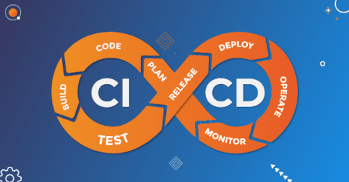
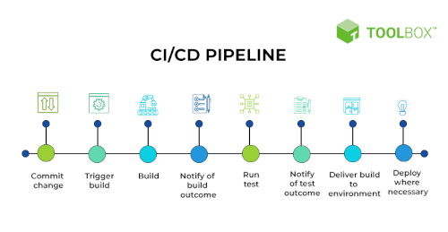
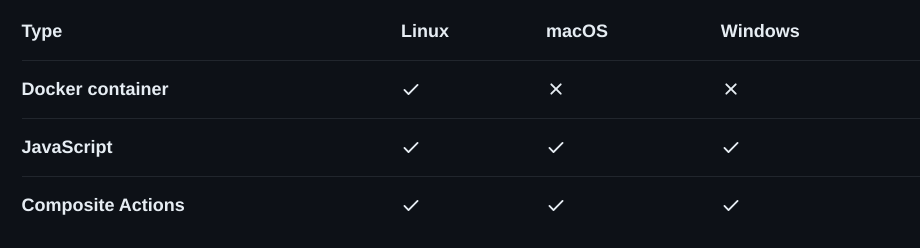

# CI/CD on Github

### CI/CD in breve e come usarla su Github

---

## Cosa significa "Continuous Integration / Continuous Delivery(Development)"

<!-- _class: lead gaia -->
<!-- fit -->

"CI/CD è un metodo per la distribuzione frequente delle app ai clienti, che prevede l'introduzione dell'automazione nelle varie fasi di sviluppo applicativo. Si basa principalmente sui concetti di integrazione, distribuzione e deployment continui. L'approccio CI/CD supera le difficoltà legate all'integrazione di nuovo codice, una situazione così problematica per i team operativi e di sviluppo da essere denominata "inferno dell'integrazione"."

\*source: [redhat.com](https://www.redhat.com/it/topics/devops/what-is-ci-cd)

---

## Github Actions

"GitHub Actions makes it easy to automate all your software workflows, now with world-class CI/CD. Build, test, and deploy your code right from GitHub. Make code reviews, branch management, and issue triaging work the way you want."

- [Github actions](https://github.com/features/actions)
- [Github actions marketplace](https://github.com/marketplace?query=sort%3Apopularity-desc&type=actions)
- [Github Workflow Sintax](https://docs.github.com/en/actions/using-workflows/workflow-syntax-for-github-actions)

\*source: [github.com](https://github.com/features/actions)

---

## Github Actions more deeply

Ci sono essenzialmente 3 tipi di Github actions:

- Docker container ( + consistente | - veloce | non è compatibile con tutti gli OS )
- Javascript ( + facile [creare custom actions](https://github.com/actions/toolkit) )
- Composite Actions( + actions in una sola [esempio](https://docs.github.com/en/actions/creating-actions/creating-a-composite-action))

\*source: [github.com](https://docs.github.com/en/actions/creating-actions/about-custom-actions)

---

## A Github action deploy example: Github pages

<!-- _class: lead gaia -->

- [Create a github page site](https://docs.github.com/en/pages/getting-started-with-github-pages/creating-a-github-pages-site)
- [Github pages settings](https://github.com/mbaroncini/github_ci/settings/pages)

---

## A Github action example: Release please, a changelog generator

- [Versionamento semantico](https://semver.org/lang/it/)
- [Conventional commits](https://www.conventionalcommits.org/en/v1.0.0/)
- [Google release please Github action](https://github.com/marketplace/actions/release-please-action)
- [Permessi actions](https://github.com/mbaroncini/github_ci/settings/actions)

---

## Credits

<!-- _class: lead -->

- [Marp CLI](https://github.com/marp-team/marp-cli)
